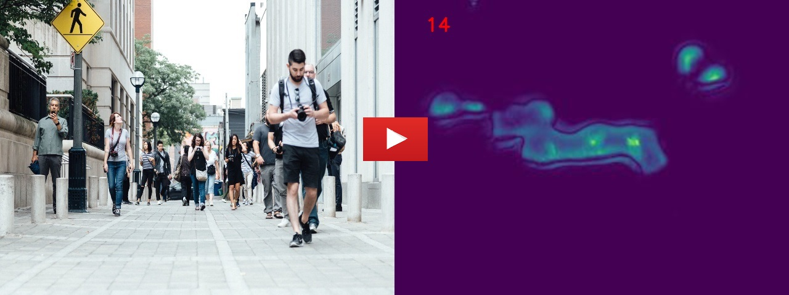

# Crowd-Counting-Density-Based

This network is used for crowd counting and also density map visualization, this network is inspired by [here](https://github.com/Pongpisit-Thanasutives/Variations-of-SFANet-for-Crowd-Counting)
The model was evaluated in various datasets, we provide many samples which are collected from different scenarios to show the performance of this network, and test samples could be downloaded from [here](https://drive.google.com/file/d/1BrFOcpV-7bua8Z-UNneyKAbs0iw5ZTKC/view?usp=sharing)

# A video from the results on the dataset

[](https://youtu.be/XjtfAY3GVUs)

# Test
Please download the network weights from  [here](https://drive.google.com/file/d/1cIez_FfyuiqnowLmio7tw7KaUDC-rToe/view?usp=sharing), then extract it in bestmodel directory
then 
Download the dataset from [here](https://drive.google.com/file/d/1BrFOcpV-7bua8Z-UNneyKAbs0iw5ZTKC/view?usp=sharing) and then extract it test directoy

Run
```
python3 detect.py
```

For creating a video from the results
```
python3 video-creator.py
``


An [ipynb file](Density-Based-CC.ipynb) is provided for running this network on google colab


